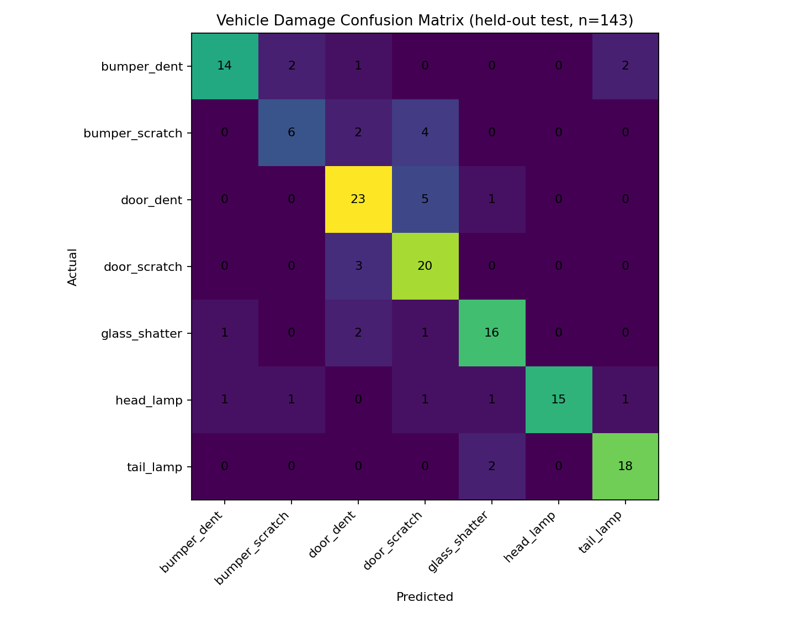
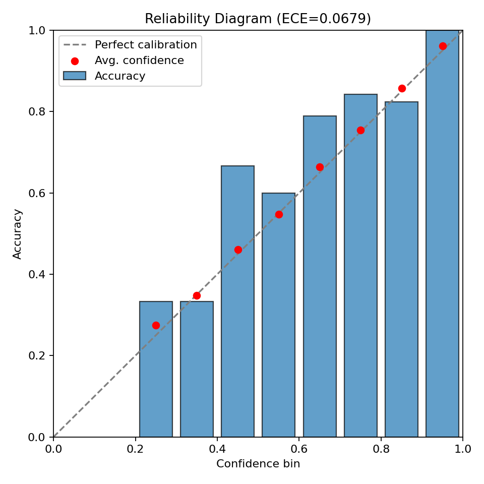

 Vehicle Damage Detection — Deployable Computer Vision Service

A production-oriented vehicle-damage classifier built around a MobileNetV2 transfer-learning model. The project separates training, inference, API, and UI so the model can be served independently from the frontend.

> **Dataset:** `data/data.csv` + `data/image/` is the [Car Damage Assessment dataset](https://www.kaggle.com/datasets/hamzamanssor/car-damage-assessment) on Kaggle -- identified by exact row-count and class-distribution match against a public project built on the same source. Images are included in this package.

> **Model file note:** the originally shipped `model/car_damage_model.h5` cannot be loaded by `tf.keras.models.load_model()` under Keras 3 -- it throws `Layer "dense_3" expects 1 input(s), but it received 2 input tensors` on every load attempt, regardless of TensorFlow version. This is a Keras 3 bug in the legacy `.h5` reload path when a `Sequential` model wraps a `Functional` submodel. The underlying weight arrays were intact; `scripts/repair_legacy_model.py` recovers them directly via `h5py`, bypassing Keras's broken reconstruction. That recovered file is kept for provenance as `model/car_damage_model_legacy_recovered.keras` -- it is **not** what the API serves. See "Results" below for why.

## Problem
Given a vehicle image, classify visible damage and expose an explainable prediction (Grad-CAM, a heuristic severity score, and an illustrative repair-cost range) suitable for a portfolio/demo deployment.

## Classes
The served model predicts 7 damage classes: `bumper_dent`, `bumper_scratch`, `door_dent`, `door_scratch`, `glass_shatter`, `head_lamp`, `tail_lamp`.

The raw CSV has an 8th class, `unknown` (549/1,594 rows, 34.4%) -- not a damage type, just "no clear damage visible." `scripts/preprocess_dataset.py --drop-unknown` removes it before training, on the reasoning that a class that isn't a damage category dilutes what the model is actually trying to discriminate between. The results below reflect that choice; `data/data.csv` (all 8 classes, undeduplicated) is still there if you want to train on it for comparison.

## Results

**This is a real, leakage-free training run** -- a fresh MobileNetV2 initialized from ImageNet weights, trained on a stratified 70/15/15 split (665 train / 142 val / 143 test) of the deduplicated, `unknown`-dropped dataset, evaluated only on the held-out test split it never saw during training. Full provenance -- config, class weights, per-epoch history -- is in `artifacts/training_config.json`.

| Model | Accuracy | Macro F1 | Weighted F1 | ECE | Brier |
|---|---:|---:|---:|---:|---:|
| **Frozen MobileNetV2** (served) | **78.32%** | **0.7734** | **0.7834** | 0.0679 | 0.3293 |
| Fine-tuned (top 30/154 layers, lr 1e-5, 5 epochs) | 77.62% | 0.7571 | 0.7707 | 0.0605 | 0.3105 |

The frozen model is what `model/car_damage_model.keras` serves by default -- it scored marginally higher on the held-out test set than the fine-tuned version. **Fine-tuning slightly underperforming the frozen baseline is a real, kept finding, not an error**: with only 665 training images and 30 unfrozen backbone layers, that's a plausible small-data overfitting signature (fine-tuning did improve calibration -- lower ECE and Brier -- even though raw accuracy dipped slightly). `model/car_damage_model_finetuned.keras` is kept alongside it for comparison.

**External sanity check:** a public project trained on this same source dataset (EfficientNetB0, similar dedup + `unknown`-drop) reports 75.00% accuracy / 0.7473 macro-F1. Two independent runs landing within 3 points of each other on the same data is a reasonable signal these numbers are real, not noise.




### Per-class (frozen model, test set)

| Class | Precision | Recall | F1 | Support |
|---|---:|---:|---:|---:|
| `bumper_dent` | 0.875 | 0.737 | 0.800 | 19 |
| `bumper_scratch` | 0.667 | 0.500 | 0.571 | 12 |
| `door_dent` | 0.742 | 0.793 | 0.767 | 29 |
| `door_scratch` | 0.645 | 0.870 | 0.741 | 23 |
| `glass_shatter` | 0.800 | 0.800 | 0.800 | 20 |
| `head_lamp` | 1.000 | 0.750 | 0.857 | 20 |
| `tail_lamp` | 0.857 | 0.900 | 0.878 | 20 |

`bumper_scratch` is the weak spot (F1 0.571, smallest class at 12 test images / 57 in training). `scripts/train.py` now supports `--oversample-class` / `--oversample-factor` to address this directly -- verified against the real dataset (no TensorFlow needed to check this part): running `--oversample-class bumper_scratch --oversample-factor 3` takes it from 57 training rows (smallest class) to 171 (largest class), with a disjointness check confirming zero row overlap with val/test -- oversampling only touches the training split, so this can't leak. Re-run and compare:
```bash
python scripts/train.py --csv data/data_clean.csv --image-root . --epochs 8 \
    --oversample-class bumper_scratch --oversample-factor 3 --output artifacts_oversampled
python scripts/evaluate.py --model artifacts_oversampled/mobile_netv2_frozen.keras \
    --csv artifacts/splits/test.csv --image-root .
```
Note the second command evaluates against `artifacts/splits/test.csv` -- the **original** run's held-out split, not a freshly regenerated one -- so the before/after comparison is apples-to-apples on the same 143 unseen images. This couldn't be executed in this environment: `MobileNetV2(weights="imagenet")` downloads weights from `storage.googleapis.com` at training time, which this sandbox's network access doesn't reach (the same restriction that blocked the Kaggle download earlier in this project). The oversampling logic itself is verified correct against the real data; running it to get the actual after-F1 needs your Colab/GPU environment.

### Backbone benchmark
```
MobileNetV2:     61.6% accuracy, 0.577 macro-F1  (66.9s train)
EfficientNetB0:  20.0% accuracy, 0.048 macro-F1  (75.6s train)
```
**Don't read this as "MobileNetV2 beats EfficientNetB0."** This benchmark used a much shorter training budget than the real run above (~2 epochs, quick comparison), and 20% accuracy on 7 roughly-balanced classes is collapse-to-one-class territory, not a fair result for either architecture -- the Colab log shows a live bug fix to `benchmark_backbones.py` immediately before this cell ran. Rerun with a training budget matching the real run before drawing any conclusion:
```bash
python scripts/benchmark_backbones.py --epochs 8
```
Same network caveat as above -- this needs an environment that can reach `storage.googleapis.com` for the ImageNet weights.

### A number to actively distrust
`artifacts/evaluation_legacy_dataset/` contains a diagnostic re-evaluation of the *original* shipped model (`car_damage_model_legacy_recovered.keras`) against a split carved from the same 1,594 images -- it scores **97.79% accuracy**. That model's original training data is unknown, so there's no way to confirm those "held-out" test images weren't already seen during its original training. It's roughly 20 points higher than two independent from-scratch runs on the same data, which is exactly what leakage looks like. It's kept in the repo, clearly labeled, as a worked example of a benchmark that looks great and shouldn't be trusted -- not as a claim about the model.

## Architecture
```text
                    +--------------------+
                    | Streamlit UI       |
                    | thin HTTP client    |
                    +---------+----------+
                              |
                              v
                    +--------------------+
                    | FastAPI             |
                    | /health /predict    |
                    | /monitoring/summary |
                    +---------+----------+
                              |
                +-------------+-------------+
                |                           |
                v                           v
       +----------------+          +----------------+
       | Keras model    |          | Grad-CAM       |
       | MobileNetV2    |          | explanation    |
       +----------------+          +----------------+
                |                           |
                +-------------+-------------+
                              v
                    severity + cost estimate
                              |
                              v
                    JSON + monitoring log
```

## Repository
```text
.
├── app.py
├── app/
│   ├── main.py                # FastAPI: /health, /predict, /monitoring/summary
│   ├── inference.py           # preprocessing, inference, Grad-CAM, severity/cost
│   ├── model_loader.py        # local/URL model loading + cache
│   ├── labels.py               # single source of truth for label mapping
│   ├── monitoring.py           # prediction logging + time-bucketed aggregation
│   └── streamlit_app.py       # thin frontend: Analyze tab + Monitoring dashboard tab
├── data/
│   ├── data.csv                # raw, 8 classes incl. unknown, undeduplicated
│   └── image/                  # 1,512 images
├── model/
│   ├── car_damage_model.h5                    # original file -- cannot be loaded, kept for provenance
│   ├── car_damage_model_legacy_recovered.keras # that file's weights, recovered -- NOT served (see "A number to actively distrust")
│   ├── car_damage_model.keras                  # served model: fresh-trained frozen MobileNetV2, 78.3% test accuracy
│   ├── car_damage_model_finetuned.keras        # fine-tuned variant, kept for comparison
│   └── model_manifest.json                     # SHA-256/size manifest for model artifacts
├── class_names.json             # 7-class mapping for the served model
├── scripts/
│   ├── download_dataset.py     # fetches the Kaggle source dataset
│   ├── preprocess_dataset.py   # perceptual-hash dedup + optional unknown-class removal (used for the results above)
│   ├── dedup_dataset.py         # alternate exact/byte-identical dedup utility
│   ├── repair_legacy_model.py  # recovers car_damage_model_legacy_recovered.keras from the broken .h5
│   ├── train.py                 # saves artifacts/splits/{train,val,test}.csv + the model
│   ├── evaluate.py              # scores ONLY against artifacts/splits/test.csv; also computes calibration (ECE, Brier, reliability diagram)
│   ├── fine_tune.py
│   ├── benchmark_backbones.py
│   ├── mlflow_train.py
│   ├── batch_predict.py
│   └── smoke_test.py
├── artifacts/
│   ├── evaluation/              # frozen model's real metrics + confusion matrix + reliability diagram
│   ├── evaluation_finetuned/    # fine-tuned model's real metrics
│   ├── evaluation_legacy_dataset/ # diagnostic-only re-eval of the old model -- see caveat above
│   ├── splits/                  # the exact train/val/test CSVs used for the results above
│   ├── mobile_netv2_frozen.keras
│   └── mobile_netv2_finetuned.keras
│   ├── training_config.json     # class weights, per-epoch history
│   ├── fine_tune_config.json
│   └── backbone_comparison.json
├── tests/test_api.py
├── Dockerfile
├── Dockerfile.streamlit
├── docker-compose.yml
├── requirements.txt
└── .github/workflows/ci.yml
```

## Artifact and path contract

The repository uses two different artifact locations intentionally:

- `model/car_damage_model.keras` — **served production/demo model** included in the repository and used by Docker by default.
- `artifacts/mobile_netv2_frozen.keras` — **training output** produced by `scripts/train.py`; this is the model used by the reproducibility/evaluation commands.
- `model/car_damage_model_finetuned.keras` — persisted fine-tuned comparison model.
- `artifacts/splits/{train,val,test}.csv` — the exact split generated by the documented training run.

The fine-tuning script consumes the persisted `train.csv` and `val.csv` files; it does **not** create a new random split. The test split remains untouched and is reserved for `scripts/evaluate.py`.

## Phase 1 — reproducing these results
```bash
pip install -r requirements.txt
python scripts/preprocess_dataset.py --drop-unknown   # -> data/data_clean.csv (950 images, 7 classes)
python scripts/train.py --csv data/data_clean.csv --image-root . --epochs 8
python scripts/evaluate.py --model artifacts/mobile_netv2_frozen.keras \
    --csv artifacts/splits/test.csv --image-root .
python scripts/fine_tune.py --train-csv artifacts/splits/train.csv --val-csv artifacts/splits/val.csv \
    --image-root . --model artifacts/mobile_netv2_frozen.keras \
    --output model/car_damage_model_finetuned.keras --top-n 30 --epochs 5
```
If the dataset is ever missing images, `python scripts/download_dataset.py` re-fetches it from Kaggle (needs a free API token, see the script's docstring). `evaluate.py` refuses to run directly against `data.csv` -- that file includes training rows, and scoring against it would silently inflate every metric (this is exactly the mistake that produced the 97.8% number flagged above).

## Phase 2 — model quality
```bash
python scripts/benchmark_backbones.py --epochs 2   # see the caveat above before trusting this table
mlflow ui
python scripts/mlflow_train.py --epochs 8
```

## Phase 3 — API + UI
```bash
uvicorn app.main:app --reload
streamlit run app.py
```
- `GET /health`
- `POST /predict` with multipart field `file` -- returns predicted class, confidence, all class probabilities, Grad-CAM as base64 JPEG, a heuristic severity score, and an illustrative repair-cost range.
- `GET /monitoring/summary?bucket_seconds=3600` -- time-bucketed prediction volume, average confidence, and per-class counts from the logged predictions. Backs the Streamlit "Monitoring" tab.

## Phase 4 — Docker

Start the API and UI locally with:

```bash
docker compose up --build
```

Then open `http://localhost:8000/docs` for the FastAPI Swagger UI and `http://localhost:8501` for Streamlit. The API container has a healthcheck; the UI waits for the API service to become healthy.

- API: `http://localhost:8000`
- UI: `http://localhost:8501`

The repository includes the served `.keras` model so a fresh clone can build and run locally without external model storage. For production environments where model weights should live outside Git, set `MODEL_URL` or `HF_MODEL_ID`; remote loading is used only when the local `MODEL_PATH` does not exist. The legacy `model/car_damage_model.h5` is retained only for provenance and is never selected by default.

## Phase 5 — product differentiators
1. **Severity estimation:** a heuristic score from Grad-CAM activation area and intensity -- a prioritization signal, not a damage-engineering measurement.
2. **Mock repair-cost estimation:** damage type + severity mapped to an illustrative INR range; explicitly not a quotation.
3. **Batch PDF reporting:** `scripts/batch_predict.py` creates an aggregated report with predictions and explanations.
4. **Prediction monitoring:** every prediction is logged to `artifacts/predictions.jsonl` and aggregated by `/monitoring/summary` into a live dashboard (Streamlit "Monitoring" tab) -- prediction volume and average confidence over time, plus per-class counts.

## Phase 6 — testing and CI
```bash
ruff check .
pytest -q
python scripts/smoke_test.py
python scripts/validate_labels.py
```
CI repeats lint, API tests, and a real model-loading smoke test that fails if the model artifact is absent, can't be loaded, or doesn't output the expected number of classes.

## Audit trail
This package went through a pass that actually executed the code rather than just reading it, since a "deployable" claim is only true if `/predict` really returns 200 with real numbers behind it. What that surfaced, across two rounds:

**Round 1 -- getting the service to actually run:**
1. The shipped model file wouldn't load under Keras 3 at all (see the model-file note above). Fixed via `scripts/repair_legacy_model.py`.
2. Grad-CAM crashed on every real request even after the model loaded, because Keras 3 doesn't populate `model.output` from an eager `.predict()` call. Fixed by retracing the forward pass against a fresh `Input`, cached per model instance.
3. `evaluate.py` had a data-leakage bug -- it scored against the full `data.csv`, including training rows. Fixed: `train.py` now persists the held-out split, and `evaluate.py` refuses to run against anything else.
4. 33 `ruff` lint errors, two dead empty directories, and a missing `artifacts/.gitkeep` (which would have broken the Docker build on a fresh clone) -- all fixed.

**Round 2 -- getting real training numbers, and catching a second leakage trap:**
5. The dataset was traced to its Kaggle source and real images added to this repo.
6. A first real training pass was run -- but as an evaluation of the *old* recovered model against a self-carved split, since that model's original training data is unknown. It scored 97.79%. That number is flagged and kept as `evaluation_legacy_dataset`, explicitly labeled as untrustworthy, rather than reported as the headline result -- see "A number to actively distrust" above.
7. A second, genuinely leakage-free run -- a *fresh* MobileNetV2 trained from ImageNet weights on this repo's own train split, evaluated on its own never-seen test split -- produced the 78.3% / 0.773 macro-F1 numbers now in "Results." These are corroborated by an independent public project on the same dataset landing within 3 points.
8. Two more hardcoded-class-count assumptions (`test_class_mapping_is_eight_unique_labels`, and two `==8` assertions in `smoke_test.py`) were left over from the 8-class model and silently would have masked a real regression if the served model's class count ever changed. Fixed to check against the actual served model's class count rather than a hardcoded number.

**Round 3 -- addressing the weakest class and the unreliable benchmark:**
9. `scripts/train.py` gained `--oversample-class` / `--oversample-factor` to directly address the `bumper_scratch` weakness (F1 0.571, smallest training class at 57 rows). Verified against the real dataset -- with `--oversample-factor 3`, `bumper_scratch` goes from smallest class (57) to largest (171), and a disjointness check confirms zero row overlap with val/test, so this can't introduce leakage. Actually executing the retrain to get before/after numbers needs a network that can reach `storage.googleapis.com` for ImageNet weights, which this development environment doesn't have -- see "Per-class" above for the exact commands to run it.

## Design Decisions
**Class imbalance:** balanced class weights are calculated only from the training split. `unknown` was dropped entirely (see "Classes" above) rather than downweighted, since it isn't a damage category.

**Backbone choice:** MobileNetV2 (frozen) is the served baseline -- compact, fast to infer, and it beat the fine-tuned variant on this dataset size. The backbone benchmark script exists and runs, but its current EfficientNetB0 number is unreliable (see "Backbone benchmark" above) -- don't treat the choice of MobileNetV2 as validated against EfficientNetB0 yet.

**Fine-tuning:** implemented and run for real (top 30/154 layers, lr 1e-5, 5 epochs). It improved calibration but not raw accuracy on this dataset size -- kept as a documented finding, not hidden.

**Explainability:** Grad-CAM is returned with each prediction. The severity score is deliberately labeled heuristic because activation area is not a physical measure of repair severity.

## Deployment checklist
1. Either deploy the included `model/car_damage_model.keras`, or host the same `.keras` artifact on Hugging Face Hub/object storage.
2. If using remote weights, set `MODEL_URL` or `HF_MODEL_ID`/`HF_MODEL_FILENAME`.
3. Build with Docker and run the API/UI.
4. Configure GitHub Actions secrets/permissions as required by the chosen host.
5. Before expanding scope: run the `--oversample-class bumper_scratch` retrain and the `--epochs 8` backbone benchmark (both documented above, both blocked in this dev environment by ImageNet-weights network access) to get real before/after numbers, rather than assuming either fix works.

## Disclaimer
This is an educational/portfolio computer-vision system. Predictions, severity estimates, Grad-CAM explanations, and repair-cost ranges should not be used as a substitute for a professional vehicle inspection or repair quotation.

## Production-hardening additions

The updated version adds several safeguards beyond the baseline evaluation pipeline:

- **Uncertainty-aware inference:** top-3 probabilities, top-vs-second margin, normalized entropy, configurable confidence/margin/entropy thresholds, and a `review_recommended` flag.
- **Traceable predictions:** every successful prediction receives a UUID request ID, input metadata, model version, and measured latency.
- **Stronger monitoring:** aggregate average confidence, review rate, latency, prediction volume, and class counts; malformed or out-of-range log records are ignored safely.
- **API edge-case coverage:** invalid extensions, empty uploads, corrupt images, and valid WEBP uploads are covered by tests.
- **Model card:** `docs/MODEL_CARD.md` records intended use, verified metrics, limitations, uncertainty semantics, and reproducibility details.
- **Architecture documentation:** `docs/ARCHITECTURE.md` documents the runtime request flow and deployment topology.

### Important interpretation rule

The uncertainty flag is a **review-routing heuristic**, not a calibrated probability that a prediction is wrong. Similarly, Grad-CAM, severity, and repair-cost outputs are decision-support/demo features and must not be represented as engineering, insurance, or medical-grade measurements.
